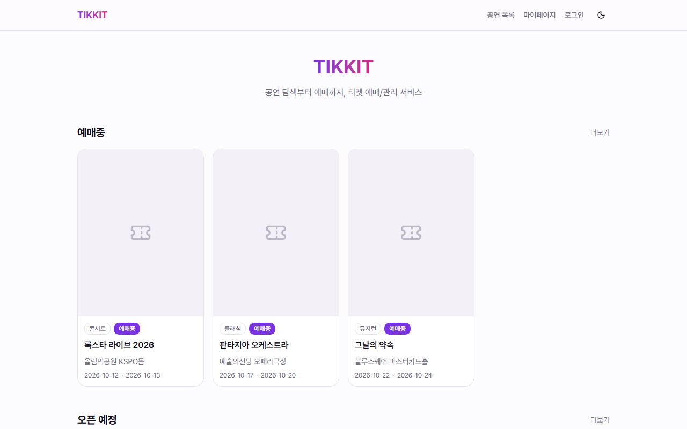
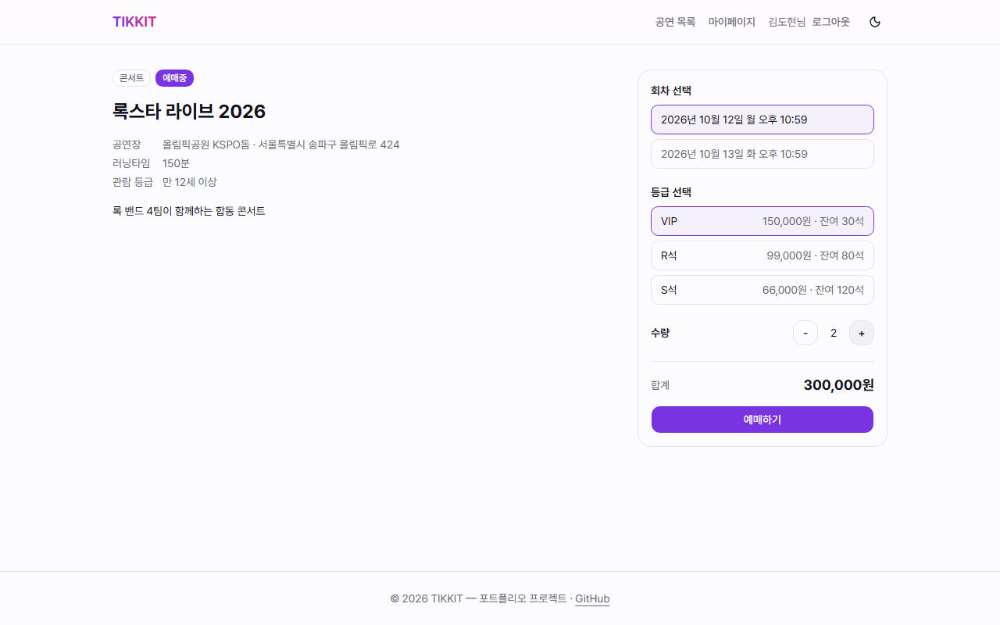
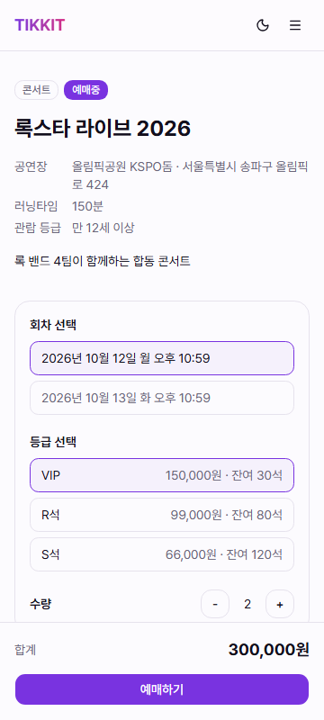
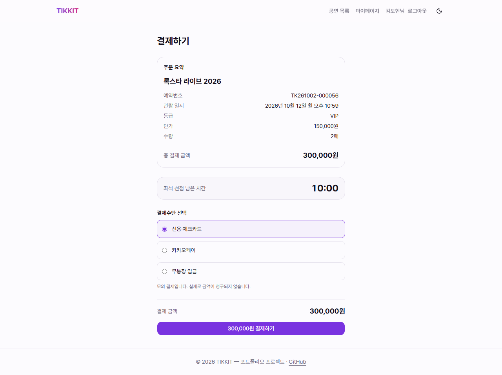
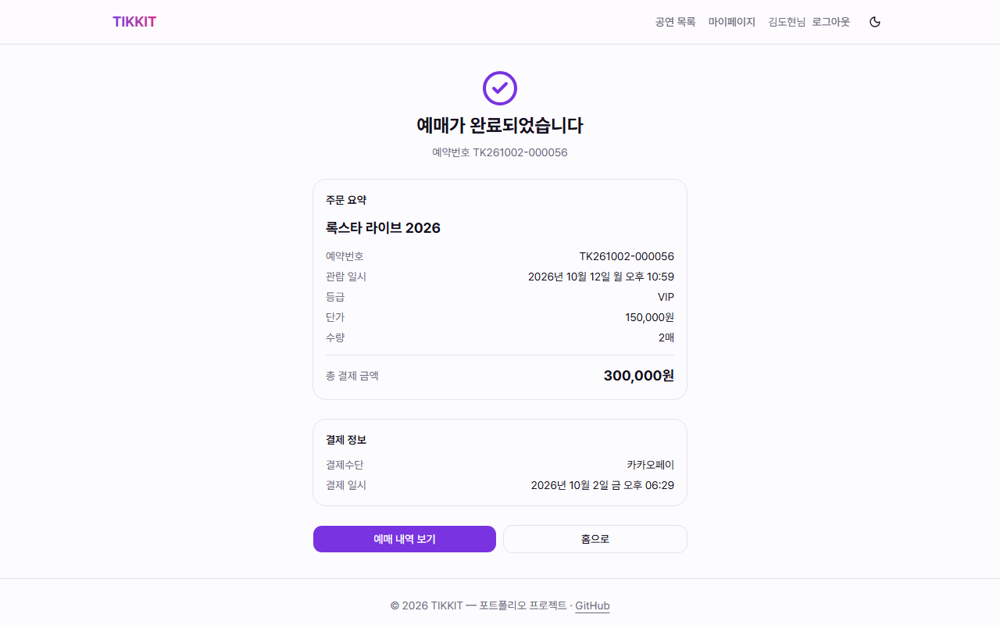
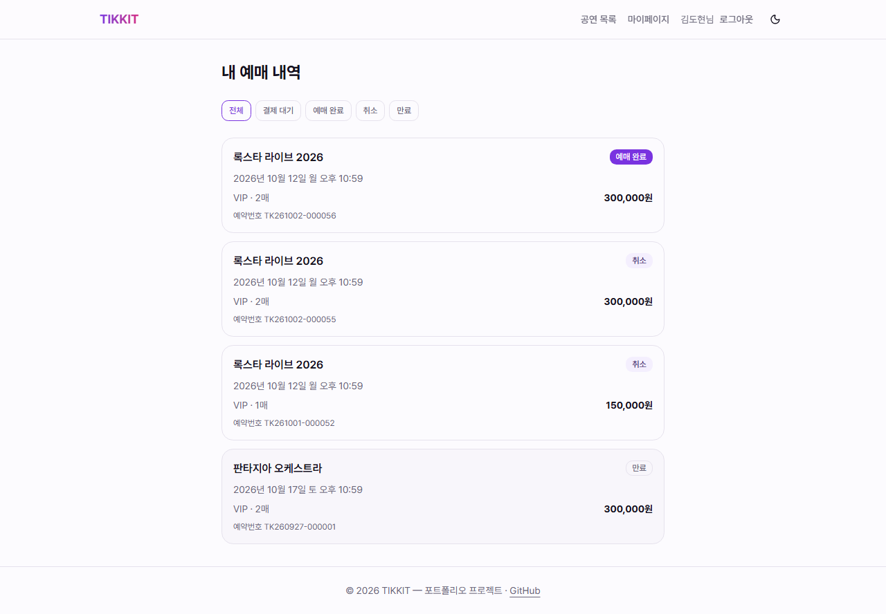
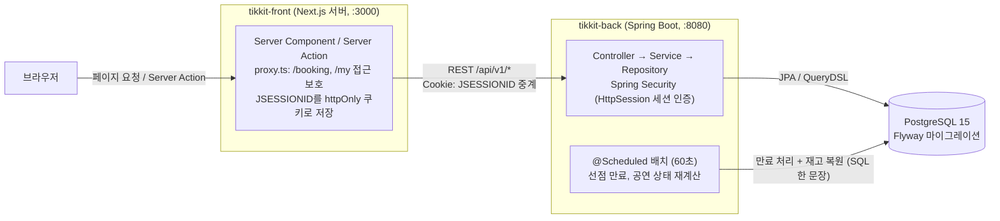

# TIKKIT

[](https://github.com/flyingRKO/TIKKIT/actions/workflows/ci.yml)

단순한 예매 MVP에서 출발해 동시성·지정석·대기열·성능·운영을 단계적으로 개선하며, 매 단계를 재현 → 해결 → 수치로 증명하는 티켓 예매 서비스 (포트폴리오 프로젝트)

## 진행 상황

**MVP 완성 (`v0.1.0-mvp`) — Phase 0~4 완료, 17/33 Task** — 회원가입·로그인부터 공연 탐색, 예매 선점, 모의 결제, 취소까지 한 흐름으로 동작하고, 이 흐름은 Playwright E2E로 CI에서 검증합니다. 다음은 Phase 5(동시성 제어 고도화)입니다. 전체 계획은 [`docs/ROADMAP.md`](docs/ROADMAP.md)에서 확인할 수 있습니다.

## 스크린샷

| 메인 | 공연 상세 | 공연 상세 (모바일 360px) |
|---|---|---|
|  |  |  |

| 결제 | 예매 완료 | 예매 내역 |
|---|---|---|
|  |  |  |

스크린샷은 `npm run screenshots`로 다시 만들 수 있습니다 ([E2E 테스트](#e2e-테스트) 참고). 포스터 이미지는 시드 데이터에 URL이 없어서 placeholder로 표시됩니다.

## 문서

| 문서 | 내용 |
|---|---|
| [`docs/PRD.md`](docs/PRD.md) | MVP 요구사항, 기능 명세, API 계약 |
| [`docs/ERD.md`](docs/ERD.md) | DB 스키마, 정규화·동시성·마이그레이션 설계 |
| [`docs/ROADMAP.md`](docs/ROADMAP.md) | Phase 0~9, Task 001~033 개발 로드맵 |

## 기술 스택

| 영역 | 기술 |
|---|---|
| 프론트엔드 | Next.js 16.2.3 (App Router), React 19.2.4, TypeScript 5, TailwindCSS v4 |
| 백엔드 | Spring Boot 3.4.5, Java 21, Spring Data JPA + QueryDSL + MyBatis |
| 데이터베이스 | PostgreSQL 15 (Docker), Flyway |
| 테스트·CI | JUnit 5 + Testcontainers (BE), Playwright (E2E), GitHub Actions |

## 아키텍처



- 브라우저는 BE를 직접 호출하지 않습니다. BE 호출은 전부 Next 서버(Server Component, Server Action)에서 일어나고, 로그인 세션 쿠키도 Next가 받아서 BE로 그대로 중계합니다.
- 인증은 서버 메모리의 `HttpSession`을 씁니다. 서버를 여러 대로 늘릴 때 생기는 문제와 대안(Redis 세션/JWT)은 Phase 7(Task 026)에서 다룹니다.
- 선점 후 10분 안에 결제하지 않은 예약은 만료 배치가 정리하고 재고를 복원합니다.

## 프로젝트 구조

```
TIKKIT/
├── tikkit-front/   # Next.js 프론트엔드 (e2e/: Playwright 테스트)
├── tikkit-back/    # Spring Boot 백엔드
└── docs/           # PRD, ERD, ROADMAP, 스크린샷(images/)
```

## 로컬 개발 환경

### 백엔드

```bash
cd tikkit-back
cp .env.example .env   # 최초 1회
docker-compose up -d   # PostgreSQL 실행 (Docker Desktop 필요)
./gradlew bootRun       # http://localhost:8080
```

기동 시 Flyway가 V1 스키마와 dev 시드 데이터를 자동 적용합니다. 테스트 계정(비밀번호 모두 `Password1!`):

| 이메일 | 권한 |
|---|---|
| `user@tikkit.com` | USER |
| `admin@tikkit.com` | ADMIN |

### 프론트엔드

```bash
cd tikkit-front
npm install
npm run dev              # http://localhost:3000
```

### E2E 테스트

가입 → 로그인 → 선점 → 결제 → 취소 흐름을 실제 브라우저로 검증합니다. BE를 목킹하지 않고 실제 BE와 DB를 쓰기 때문에, **BE를 dev 프로필로 먼저 띄워 둬야 합니다** (공연 시드 데이터가 dev 프로필에서만 들어갑니다).

```bash
cd tikkit-front
npx playwright install chromium   # 최초 1회
npm run build                     # E2E는 프로덕션 빌드(next start)로 돌립니다
npm run test:e2e                  # 회귀 테스트
npm run screenshots               # README용 스크린샷 재생성 (docs/images/)
```

- 시드 공연의 날짜는 "시드를 적용한 시점" 기준 상대 날짜입니다. 같은 DB를 오래 쓰면 공연이 하나씩 판매 종료되고, 적용한 지 약 50일이 지나면 예매중 공연이 하나도 남지 않아 테스트가 실패합니다. 이때는 `docker-compose down -v`로 볼륨까지 지우고 다시 띄우세요.
- 테스트는 매번 새 회원(`e2e-{timestamp}@tikkit.com`)으로 가입하고 마지막에 예약을 취소해서 재고를 되돌립니다. 가입한 회원은 DB에 남습니다.
- CI에서는 `e2e` 잡이 Postgres 서비스 컨테이너를 매번 새로 만들어서 같은 순서로 실행합니다. `screenshots`는 CI에서 돌리지 않습니다.

## 포트폴리오 포인트 (예정)

MVP 완성 이후 아래 항목을 순서대로 진행하며, 각 단계는 `docs/improvements/`에 **문제 → 재현 → 원인 분석 → 해결 → before/after 수치**로 기록할 예정입니다.

- **동시성 제어 진화**: 의도적으로 동시성을 보장하지 않는 재고 차감으로 MVP를 출시한 뒤, 초과 판매를 테스트로 재현하고 DB 락 → Redis 분산 락 순으로 비교·개선
- **지정석 전환**: 등급별 수량 모델 → 실제 좌석 모델로 무중단(expand → backfill → contract) 스키마 마이그레이션
- **성능 최적화**: k6 부하 테스트로 병목을 찾고 인덱스·캐싱 전후 수치 비교
- **대기열 시스템**: Redis 기반 대기열로 오픈런 트래픽 대응

자세한 내용은 [`docs/ROADMAP.md`](docs/ROADMAP.md)의 Phase 5~9를 참고하세요.

## 알려진 한계: 동시성

`POST /api/v1/reservations`(예매 선점)의 재고 차감은 의도적으로 동시성을 보장하지 않습니다.
`remaining_quantity`를 읽어서 빼고 더티체킹으로 반영하는 단순한 방식이라, 동시 요청이 몰리면 lost update로
초과 판매가 날 수 있습니다. MVP는 이 한계를 그대로 두고 출시한 뒤, Phase 5(Task 018~020)에서
100개 스레드로 초과 판매를 재현하는 테스트를 먼저 작성하고 DB 락 → Redis 분산 락 순으로 비교·개선할 예정입니다.

## 알려진 한계: 결제-만료 배치 경쟁

결제 승인(`POST /api/v1/reservations/{id}/payments`)과 선점 만료 배치(60초 주기)가 같은 예약을 동시에
건드리는 경우를 막지 않습니다. 두 처리 모두 "현재 상태가 PENDING인지"를 먼저 확인하지만 그 확인과 실제
반영 사이에 조건부 UPDATE 같은 잠금 장치가 없어서, 만료 시각 근처에 결제 요청이 들어오면 이론적으로
재고가 이중 복원되거나 결제는 성공했는데 예약이 EXPIRED로 남는 경우가 생길 수 있습니다. Phase 5의
초과 판매 재현 테스트(Task 018) 대상으로 남겨두고, 조건부 UPDATE 도입(Task 019) 때 같이 해결할 예정입니다.

## 알려진 한계: 결제 게이트웨이 호출이 트랜잭션 안에 있음

`ReservationService.pay()`는 `PaymentGateway.approve()` 호출을 같은 `@Transactional` 메서드 안에서
수행합니다. 지금은 `MockPaymentGateway`가 즉시 응답해서 문제가 없지만, 실제 PG(토스/포트원 등)로
교체하면 네트워크 I/O를 기다리는 동안 DB 커넥션(그리고 Phase 5 이후 도입될 락)을 계속 잡고 있게 되어
트래픽이 몰릴 때 커넥션 풀이 고갈될 수 있습니다. 실제 PG 연동 시점에는 승인 호출을 트랜잭션 밖으로 빼고,
승인 후 짧은 트랜잭션으로 예약 상태를 다시 확인한 뒤 확정하는 구조로 바꿔야 합니다.
