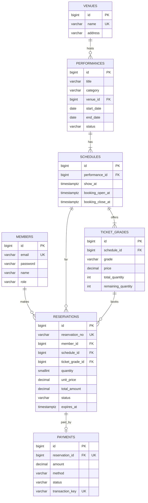
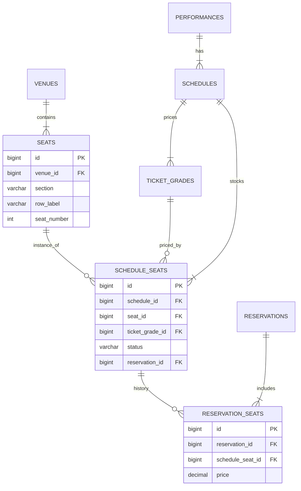

# TIKKIT ERD

MVP 스키마(V1)와, 고도화 단계(Phase 6)에서 등급별 수량 모델을 지정석 모델로 전환하는 마이그레이션(V4~V6)을 함께 기록한다. 상세 Task는 `docs/ROADMAP.md` 참조.

## 공통 규칙

- 테이블명은 복수형 snake_case(`members`, `ticket_grades`)를 쓰고, JPA 엔티티 클래스명은 단수형 PascalCase(`Member`, `TicketGrade`)로 `@Table(name = "...")`을 통해 명시 매핑한다. FK 컬럼명은 참조 대상을 단수로 표기한다(`member_id`, `ticket_grade_id`).
- PK는 `bigint GENERATED BY DEFAULT AS IDENTITY`를 쓴다(레거시 `bigserial` 대신 PostgreSQL 10+ 권장 방식).
- Enum은 `varchar` + `CHECK` 제약으로 저장한다 (`@Enumerated(EnumType.STRING)`).
- 금액은 `numeric(12,0)`(원 단위), JPA에서는 `BigDecimal` + `@Column(precision = 12, scale = 0)`로 매핑한다.
  - `float`/`double`은 이진 부동소수점 오차가 생겨 금액에 쓰지 않는다.
  - PostgreSQL `money` 타입은 `lc_monetary` 로케일 설정에 따라 동작이 달라져 비권장이다.
  - 원화 자체는 소수 단위가 없어 정수로도 정확하지만, 할인율 계산처럼 중간에 소수가 발생하는 경우와 향후 외화 확장을 감안해 `numeric`을 쓴다. precision 12는 최대 약 1조 원 미만을 담는다.
- 시간 컬럼은 `timestamptz`, Java에서는 `Instant`로 매핑한다. DB가 UTC로 저장하고 조회 시 세션 타임존에 맞춰 자동 변환하므로, 운영 환경(Docker는 보통 UTC)과 개발 환경의 서버/DB 타임존이 달라도 값이 어긋나지 않는다. (`timestamp`(타임존 없음)를 쓰면 배포 환경에 따라 최대 9시간 오차가 날 수 있어 채택하지 않는다.)
- 모든 테이블은 `created_at`, `updated_at`을 가진다 (`BaseTimeEntity`, JPA Auditing).
- 모든 테이블·컬럼에는 한국어 `COMMENT`를 단다(마이그레이션 SQL에 `COMMENT ON TABLE`/`COMMENT ON COLUMN`으로 포함). 아래 각 섹션의 SQL 블록이 실제로 쓸 문구다. 모든 테이블 공통인 `id`/`created_at`/`updated_at`은 여기서 한 번만 정의하고 개별 블록에서는 반복하지 않는다: `id IS '고유 식별자(PK)'`, `created_at IS '생성 일시'`, `updated_at IS '수정 일시'`.
- 이메일처럼 대소문자를 구분하지 않아야 하는 유니크 컬럼은 `UNIQUE(lower(email))`로 선언한다(애플리케이션에서도 저장 전 소문자로 정규화).
- 스키마는 Flyway로 관리하며 `ddl-auto: validate`를 사용한다. (`tikkit-back/CLAUDE.md`, Task 002)
- 목록 조회의 복합 인덱스나 `pg_trgm` 기반 키워드 검색은 지금 미리 추가하지 않고 Task 028에서 `EXPLAIN ANALYZE` 근거로 결정한다. 참고로 `pg_trgm`은 3자 미만 패턴에는 인덱스를 타지 않아, 2음절 한글 제목(예: "햄릿") 검색에는 한계가 있다는 점을 그때 함께 검토한다.

### 의도적 비정규화

아래는 정규화 원칙과 다르게 의도적으로 중복·파생 값을 저장한 컬럼이다. 이유를 모르고 "정규화"한다는 명목으로 제거하면 안 된다.

| 컬럼 | 이유 |
|---|---|
| `reservations.schedule_id` | `ticket_grade_id`를 거치지 않고 회차별 예약을 바로 조회하기 위한 중복 경로. `ticket_grades(id, schedule_id)` 복합 UNIQUE + `reservations`의 복합 FK로 두 경로가 항상 일치하도록 DB가 보장한다. Phase 6에서 좌석 모델로 바뀐 뒤에도 스케줄을 참조하는 유일한 경로로 남는다. |
| `ticket_grades.remaining_quantity` | 불변식은 `remaining_quantity = total_quantity - SUM(활성 예약의 quantity)`이다. 매 조회마다 집계하지 않고 Phase 5의 조건부 UPDATE(`WHERE remaining_quantity >= :qty`)가 원자적으로 갱신하는 대상이므로 컬럼으로 유지한다. **이 컬럼에는 인덱스를 걸지 않는다** — 인덱스가 있으면 매 예매마다 Postgres의 HOT(Heap-Only Tuple) 업데이트를 못 써 쓰기 비용이 커진다. |
| `reservations.unit_price` | 예매 시점의 `ticket_grades.price` 스냅샷. 이후 가격이 바뀌어도 이미 만든 예약의 금액은 변하지 않아야 한다. |
| `reservations.total_amount` | `unit_price * quantity`와 동일하지만, V1부터 `CHECK(total_amount = unit_price * quantity)` 제약으로 항상 일치함을 DB가 보장한다. Phase 6에서도 "한 예약 = 한 등급" 정책을 유지하므로 이 계산식은 그대로 쓴다. |
| `performances.status`, `start_date`, `end_date` | `schedules`의 판매 기간·공연 일시로부터 파생되는 표시/필터용 값이다. 실제 예매 가능 여부는 항상 `schedules.booking_open_at`/`booking_close_at`로 판단하고, `performances`의 이 값들은 Task 013의 만료 배치가 함께 재계산해 갱신한다(그렇지 않으면 시드 직후부터 값이 stale해진다). |

## 1. MVP 스키마 (V1)

| 테이블 | 주요 컬럼 | 제약/인덱스 |
|---|---|---|
| members | id, email varchar(255), password varchar(100), name varchar(50), phone varchar(20), role varchar(20) (USER/ADMIN) | UNIQUE(lower(email)) |
| venues | id, name varchar(100), address varchar(255) | UNIQUE(name) |
| performances | id, title varchar(200), category varchar(20) (CONCERT/MUSICAL/THEATER/CLASSIC/SPORTS), description text, poster_url varchar(500), venue_id FK, running_minutes int, age_rating varchar(20), start_date date, end_date date, status varchar(20) (UPCOMING/ON_SALE/CLOSED) | idx(status, start_date) |
| schedules (회차) | id, performance_id FK, show_at timestamptz, booking_open_at timestamptz, booking_close_at timestamptz | UNIQUE(performance_id, show_at); CHECK(booking_open_at < booking_close_at AND booking_close_at <= show_at) |
| ticket_grades | id, schedule_id FK, grade varchar(10) (VIP/R/S/A), price numeric(12,0), total_quantity int, remaining_quantity int | UNIQUE(schedule_id, grade); UNIQUE(id, schedule_id) — 복합 FK 타깃; CHECK(0 <= remaining_quantity AND remaining_quantity <= total_quantity), CHECK(price >= 0) |
| reservations | id, reservation_no varchar(20), member_id FK, schedule_id FK, ticket_grade_id FK, quantity smallint, unit_price numeric(12,0), total_amount numeric(12,0), status varchar(20) (PENDING/CONFIRMED/CANCELLED/EXPIRED), expires_at timestamptz, confirmed_at timestamptz, cancelled_at timestamptz | UNIQUE(reservation_no); CHECK(quantity BETWEEN 1 AND 4); CHECK(total_amount = unit_price * quantity); FK(ticket_grade_id, schedule_id) REFERENCES ticket_grades(id, schedule_id); idx(member_id, created_at DESC); 부분 인덱스 idx(expires_at) WHERE status = 'PENDING' |
| payments | id, reservation_id FK, amount numeric(12,0), method varchar(20) (CARD/KAKAO_PAY/BANK_TRANSFER), status varchar(20) (PAID/REFUNDED), transaction_key varchar(64), paid_at timestamptz, refunded_at timestamptz | UNIQUE(reservation_id) — 1:1; UNIQUE(transaction_key) |

`ticket_grades`에는 Task 019(낙관적 락)에서 `version bigint` 컬럼이 `V3` 마이그레이션으로 추가된다.

**한국어 COMMENT (Task 005 `V1__init_schema.sql`에 그대로 포함):**

```sql
COMMENT ON TABLE venues IS '공연장 정보';
COMMENT ON COLUMN venues.name IS '공연장 이름';
COMMENT ON COLUMN venues.address IS '공연장 주소';

COMMENT ON TABLE members IS '회원 정보';
COMMENT ON COLUMN members.email IS '로그인에 사용하는 이메일(로그인 ID), 대소문자 구분 없이 유일';
COMMENT ON COLUMN members.password IS 'BCrypt로 암호화된 비밀번호';
COMMENT ON COLUMN members.name IS '회원 이름';
COMMENT ON COLUMN members.phone IS '휴대폰 번호';
COMMENT ON COLUMN members.role IS '권한 구분 (USER: 일반 회원, ADMIN: 관리자)';

COMMENT ON TABLE performances IS '공연 정보 (뮤지컬·콘서트 등 하나의 작품 단위)';
COMMENT ON COLUMN performances.title IS '공연명';
COMMENT ON COLUMN performances.category IS '공연 분류 (CONCERT/MUSICAL/THEATER/CLASSIC/SPORTS)';
COMMENT ON COLUMN performances.description IS '공연 상세 설명';
COMMENT ON COLUMN performances.poster_url IS '포스터 이미지 URL';
COMMENT ON COLUMN performances.venue_id IS '공연이 열리는 공연장 (venues 참조)';
COMMENT ON COLUMN performances.running_minutes IS '공연 러닝타임(분)';
COMMENT ON COLUMN performances.age_rating IS '관람 연령 등급';
COMMENT ON COLUMN performances.start_date IS '전체 공연 기간 시작일 (schedules로부터 파생, 배치가 재계산)';
COMMENT ON COLUMN performances.end_date IS '전체 공연 기간 종료일 (schedules로부터 파생, 배치가 재계산)';
COMMENT ON COLUMN performances.status IS '판매 상태 (UPCOMING/ON_SALE/CLOSED, 배치가 재계산하는 파생값)';

COMMENT ON TABLE schedules IS '공연 회차 (같은 공연이라도 날짜·시간별로 별도 판매 단위)';
COMMENT ON COLUMN schedules.performance_id IS '소속 공연 (performances 참조)';
COMMENT ON COLUMN schedules.show_at IS '공연 실제 시작 일시';
COMMENT ON COLUMN schedules.booking_open_at IS '예매 시작 일시';
COMMENT ON COLUMN schedules.booking_close_at IS '예매 마감 일시';

COMMENT ON TABLE ticket_grades IS '회차별 좌석 등급 및 가격·재고 (MVP는 지정석 없이 등급별 수량으로만 관리)';
COMMENT ON COLUMN ticket_grades.schedule_id IS '소속 회차 (schedules 참조)';
COMMENT ON COLUMN ticket_grades.grade IS '좌석 등급 (VIP/R/S/A)';
COMMENT ON COLUMN ticket_grades.price IS '등급별 판매 가격 (원)';
COMMENT ON COLUMN ticket_grades.total_quantity IS '등급별 총 판매 수량';
COMMENT ON COLUMN ticket_grades.remaining_quantity IS '잔여 수량. total_quantity에서 활성 예약 수량 합을 뺀 값과 항상 같아야 하며, 동시성 제어(조건부 UPDATE)의 대상이라 인덱스를 걸지 않는다';

COMMENT ON TABLE reservations IS '예매 내역 (좌석 선점부터 결제·취소·만료까지의 상태를 관리)';
COMMENT ON COLUMN reservations.reservation_no IS '사용자에게 노출되는 예매번호 (TK{yyMMdd}-{6자리})';
COMMENT ON COLUMN reservations.member_id IS '예매한 회원 (members 참조)';
COMMENT ON COLUMN reservations.schedule_id IS '예매 대상 회차 (schedules 참조). ticket_grade_id를 거치지 않고 회차별 예약을 바로 조회하기 위한 의도적 중복 경로';
COMMENT ON COLUMN reservations.ticket_grade_id IS '예매한 좌석 등급 (ticket_grades 참조)';
COMMENT ON COLUMN reservations.quantity IS '예매 매수 (1~4매)';
COMMENT ON COLUMN reservations.unit_price IS '예매 시점의 등급별 단가 스냅샷 (이후 가격이 바뀌어도 예약 금액은 유지)';
COMMENT ON COLUMN reservations.total_amount IS '총 결제 금액 (unit_price * quantity와 항상 일치, CHECK 제약으로 보장)';
COMMENT ON COLUMN reservations.status IS '예매 상태 (PENDING/CONFIRMED/CANCELLED/EXPIRED)';
COMMENT ON COLUMN reservations.expires_at IS '선점 만료 시각 (PENDING 상태에서 이 시각이 지나면 스케줄러가 EXPIRED 처리)';
COMMENT ON COLUMN reservations.confirmed_at IS '결제 완료(확정) 시각';
COMMENT ON COLUMN reservations.cancelled_at IS '취소 처리 시각';

COMMENT ON TABLE payments IS '결제 내역 (예매 1건당 결제 1건, 모의 결제)';
COMMENT ON COLUMN payments.reservation_id IS '결제 대상 예매 (reservations 참조, 1:1)';
COMMENT ON COLUMN payments.amount IS '결제 금액 (원)';
COMMENT ON COLUMN payments.method IS '결제 수단 (CARD/KAKAO_PAY/BANK_TRANSFER)';
COMMENT ON COLUMN payments.status IS '결제 상태 (PAID/REFUNDED)';
COMMENT ON COLUMN payments.transaction_key IS '결제 거래 고유 키 (모의 결제에서는 UUID)';
COMMENT ON COLUMN payments.paid_at IS '결제 완료 시각';
COMMENT ON COLUMN payments.refunded_at IS '환불 처리 시각';
```



## 2. 지정석 전환 (Phase 6, V4~V6)

등급별 "수량"으로 관리하던 재고를 실제 좌석 단위로 전환한다. `venues`는 이미 V1에 있으므로, 이 단계는 순수하게 "좌석" 모델링만 다룬다. 3단계(expand → backfill → contract) 마이그레이션으로 진행해, 서비스 중단 없이 스키마를 바꾸는 과정 자체를 포트폴리오 소재로 남긴다.

| 테이블 | 주요 컬럼 | 제약/인덱스 |
|---|---|---|
| seats | id, venue_id FK, section varchar(10), row_label varchar(5), seat_number int, pos_x int, pos_y int | UNIQUE(venue_id, section, row_label, seat_number) |
| schedule_seats | id, schedule_id FK, seat_id FK, ticket_grade_id FK, status varchar(10) (AVAILABLE/HELD/SOLD), reservation_id FK (nullable, 현재 홀더) | UNIQUE(schedule_id, seat_id); FK(ticket_grade_id, schedule_id) REFERENCES ticket_grades(id, schedule_id); `fillfactor=90` 고려 |
| reservation_seats | id, reservation_id FK, schedule_seat_id FK, price numeric(12,0) | UNIQUE(reservation_id, schedule_seat_id) — 취소된 예약도 이력으로 남기므로 schedule_seat_id 단독 UNIQUE는 두지 않음 |

**한국어 COMMENT (Task 021 `V4__create_seat_tables.sql`에 그대로 포함):**

```sql
COMMENT ON TABLE seats IS '공연장의 물리적 좌석 배치 (venue 단위로 한 번만 정의, 회차와 무관)';
COMMENT ON COLUMN seats.venue_id IS '소속 공연장 (venues 참조)';
COMMENT ON COLUMN seats.section IS '구역 (예: A구역, VIP석)';
COMMENT ON COLUMN seats.row_label IS '열 (예: A열, B열)';
COMMENT ON COLUMN seats.seat_number IS '좌석 번호';
COMMENT ON COLUMN seats.pos_x IS '좌석 배치도 상의 x 좌표 (UI 렌더링용)';
COMMENT ON COLUMN seats.pos_y IS '좌석 배치도 상의 y 좌표 (UI 렌더링용)';

COMMENT ON TABLE schedule_seats IS '회차별 좌석 재고 및 현재 상태 (seats를 회차마다 판매 단위로 인스턴스화)';
COMMENT ON COLUMN schedule_seats.schedule_id IS '소속 회차 (schedules 참조)';
COMMENT ON COLUMN schedule_seats.seat_id IS '물리적 좌석 (seats 참조)';
COMMENT ON COLUMN schedule_seats.ticket_grade_id IS '이 좌석에 매겨진 가격 등급 (ticket_grades 참조)';
COMMENT ON COLUMN schedule_seats.status IS '좌석 상태 (AVAILABLE: 예매 가능, HELD: 선점 중, SOLD: 결제 완료)';
COMMENT ON COLUMN schedule_seats.reservation_id IS '현재 이 좌석을 선점·구매한 예약 (reservations 참조, 비어있으면 AVAILABLE)';

COMMENT ON TABLE reservation_seats IS '예약이 거쳐간 좌석의 이력 (취소된 예약도 이력으로 남기는 append-only 기록)';
COMMENT ON COLUMN reservation_seats.reservation_id IS '소속 예약 (reservations 참조)';
COMMENT ON COLUMN reservation_seats.schedule_seat_id IS '배정된 회차별 좌석 (schedule_seats 참조)';
COMMENT ON COLUMN reservation_seats.price IS '이 좌석의 결제 시점 가격 스냅샷';
```

`schedule_seats.reservation_id`(현재 이 좌석을 잡고 있는 예약)와 `reservation_seats`(예약이 거쳐간 좌석의 이력)는 역할이 다르다. 전자는 선점 시점에만 갱신되는 "현재 상태", 후자는 감사·이력용 append-only 기록이다.

`schedule_seats`에는 의도적으로 `idx(schedule_id, status)`나 `idx(reservation_id)`를 두지 않는다. 모든 선점/해제가 이 두 컬럼을 갱신하므로, 인덱스가 있으면 매번 여러 인덱스 엔트리를 다시 써야 해 HOT 업데이트를 못 쓴다. 좌석맵 조회(`WHERE schedule_id = ?`)는 이미 `UNIQUE(schedule_id, seat_id)`로 충분히 빠르고, 좌석 해제는 `reservation_seats`를 경유해 처리한다:

```sql
UPDATE schedule_seats SET status = 'AVAILABLE', reservation_id = NULL
WHERE id IN (SELECT schedule_seat_id FROM reservation_seats WHERE reservation_id = :r)
  AND reservation_id = :r;
```

`EXPLAIN ANALYZE`로 실제 병목이 확인되면 그때 인덱스를 다시 추가한다.

**등급 혼합 정책**: "한 예약 = 한 등급"을 Phase 6 이후에도 유지한다. `reservations.ticket_grade_id`/`unit_price`/`quantity`는 제거하지 않고 그대로 쓰며, 예매 API에 `seatIds`가 추가된다. 선택한 모든 좌석이 동일한 `ticket_grade_id`에 속하는지는 여러 테이블에 걸친 조건이라 DB CHECK로 표현할 수 없으므로, 서비스 레이어에서 애플리케이션 검증으로 강제한다(Task 022).

**마이그레이션 절차 (V4 expand → V5 backfill → V6 contract):**

1. **V4 (expand)**: `seats`, `schedule_seats`, `reservation_seats` 테이블 생성. 기존 테이블은 그대로 유지해 무중단 배포 가능.
2. **V5 (backfill)**:
   - venue별로 `generate_series`를 이용해 좌석 그리드를 생성한다 (해당 venue가 가진 회차 중 등급별 `total_quantity` 최댓값 기준으로 크기 결정).
   - `V5_1__seed_venue_layouts.sql`로 개발용 배치도 시드를 추가한다.
   - 회차별로 등급-구역 매핑에 따라 schedule_seats를 생성하고, 등급당 앞쪽 `total_quantity`개 좌석에만 등급을 배정한다.
   - 기존 CONFIRMED/PENDING 예약은 `ROW_NUMBER() OVER (PARTITION BY ticket_grade_id ORDER BY created_at)`로 좌석에 배정하고 상태를 SOLD/HELD로, reservation_seats 행도 생성한다.
   - 검증: 등급별 `SOLD + HELD` 건수가 기존 `total_quantity - remaining_quantity`와 일치해야 한다 (Task 021 마이그레이션 검증 테스트).
3. **V6 (contract)**: `ticket_grades`의 `total_quantity`/`remaining_quantity`/`version` 컬럼만 제거한다. `reservations` 스키마는 변경하지 않는다(한 예약=한 등급 정책 유지).

**선점 쿼리 (다중 행 조건부 UPDATE):**

```sql
UPDATE schedule_seats
SET status = 'HELD', reservation_id = :reservationId
WHERE id IN (:sortedSeatIds) AND status = 'AVAILABLE';
-- 적용된 행 수가 요청한 좌석 수와 다르면 롤백 후 409 반환
```

좌석 ID를 정렬해서 `IN` 절에 넣어 여러 사용자가 겹치는 좌석 집합을 동시에 선점할 때 데드락을 방지한다.



## 3. 예약 상태 머신

```
PENDING --(결제)--> CONFIRMED --(취소)--> CANCELLED
PENDING --(사용자 취소)--> CANCELLED
PENDING --(expires_at 경과, 스케줄러)--> EXPIRED
```

CANCELLED, EXPIRED로 전이될 때 재고(MVP: `remaining_quantity`, 지정석 전환 후: `schedule_seats.status`)를 복원한다. Phase 5(동시성 제어)부터 모든 전이는 현재 상태를 WHERE 조건에 포함하는 조건부 UPDATE로 처리한다.

## 4. 마이그레이션 이력

| 버전 | 내용 | 관련 Task |
|---|---|---|
| V1 | 초기 스키마 (venues, members, performances, schedules, ticket_grades, reservations, payments) | 005 |
| V1_1 | dev 시드 데이터 (dev 프로필 전용) | 005 |
| V3 | `ticket_grades.version` 컬럼 추가 (낙관적 락) | 019 |
| V4 | 지정석 테이블 생성 (seats, schedule_seats, reservation_seats) | 021 |
| V5 / V5_1 | 기존 데이터 좌석 배정 백필 / 개발용 배치도 시드 | 021 |
| V6 | `ticket_grades`의 수량 컬럼 제거 (contract) | 022 |
| V7 | 조회 성능 개선을 위한 인덱스 추가 | 027 |
| V8 | 대기열 활성화 플래그 (`schedules.queue_enabled`) | 030 |
