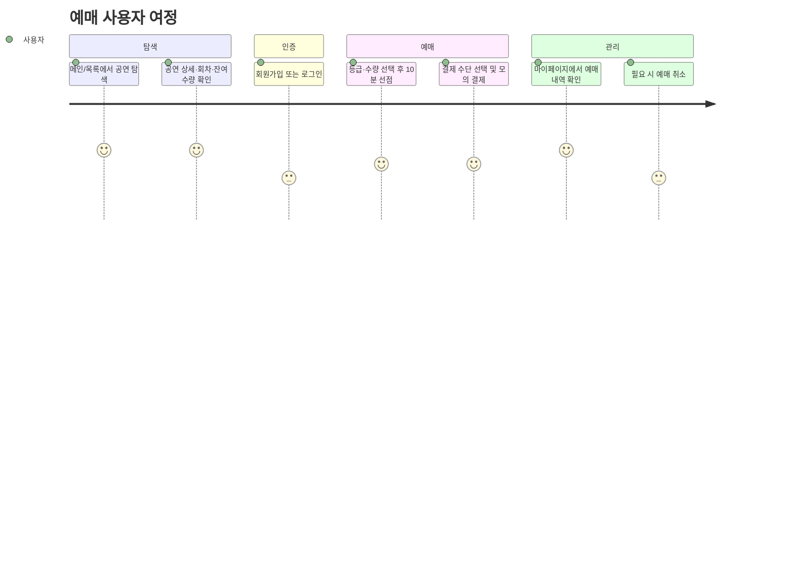

# TIKKIT PRD (MVP)

## 핵심 정보

- **목적**: 공연 예매 과정(탐색 → 선점 → 결제 → 관리)을 간결하게 제공하는 티켓 예매 서비스
- **대상 사용자**: 공연·콘서트 티켓을 웹/모바일에서 예매하는 일반 관객
- **범위**: 이 문서는 MVP 범위를 다룬다. MVP 이후 고도화(동시성 제어, 지정석 전환, 대기열, 성능, 운영)는 `docs/ROADMAP.md`에 별도로 기술한다.

## 사용자 여정



## 기능 명세

| ID | 기능 | 설명 | 페이지 |
|---|---|---|---|
| F001 | 공연 목록 조회 | 카테고리 탭, 키워드 검색, 판매상태 필터, 페이지네이션 | 메인, 공연 목록 |
| F002 | 공연 상세 조회 | 공연 정보, 회차 목록 | 공연 상세 |
| F003 | 회차별 등급·가격·잔여 수량 조회 | 실시간 잔여 수량 표시 | 공연 상세 |
| F004 | 예매 선점 | 등급 + 수량(1~4매) 선택, 10분 홀드 | 공연 상세 → 결제 |
| F005 | 모의 결제 | 결제수단 선택, 남은 시간 타이머 | 결제 |
| F006 | 예매 완료 안내 | 예매 완료 화면 | 예매 완료 |
| F007 | 내 예매 목록·상세 조회 | 상태별 필터 | 마이 예매 내역, 예매 상세 |
| F008 | 예매 취소 | PENDING/CONFIRMED 상태에서 취소, 전액 환불 처리 | 예매 상세 |
| F009 | 선점 자동 만료 | 10분 경과 시 시스템이 자동으로 만료 처리 | (시스템) |
| F010 | 회원가입 | 이메일/비밀번호 기반 가입 | 회원가입 |
| F011 | 로그인·로그아웃 | JWT 기반 인증 | 로그인, 헤더 |
| F012 | 다크모드 전환 | 라이트/다크 테마 토글 | 헤더 |

## 메뉴 구조

```
메인
├── 공연 목록 (카테고리별)
│   └── 공연 상세
│       └── 예매(결제)
│           └── 예매 완료
├── 로그인 / 회원가입
└── 마이페이지
    └── 예매 내역
        └── 예매 상세 (취소)
```

## 페이지별 상세

| 페이지 | 핵심 요소 |
|---|---|
| 메인 | 그라디언트 히어로, 오픈 예정/예매 중 섹션, 카테고리 바로가기 |
| 공연 목록 | 카테고리 탭, 검색창, 필터, 무한스크롤 또는 페이지네이션 |
| 공연 상세 | 포스터, 공연 정보, 회차 선택, 등급/수량 선택, 잔여 수량 실시간 표시 |
| 결제(선점) | 카운트다운 타이머, 주문 요약, 결제수단 선택 |
| 예매 완료 | 예매번호, 공연/회차 정보, 마이페이지 이동 버튼 |
| 로그인/회원가입 | 폼 검증, 에러 메시지 |
| 마이 예매 내역 | 상태 배지(PENDING/CONFIRMED/CANCELLED/EXPIRED), 필터 |
| 예매 상세 | 예매 정보, 결제 정보, 취소 버튼(취소 가능 조건 하에) |

## 비즈니스 규칙

- 선점(홀드) 유지 시간은 **10분**이다.
- 하나의 예약은 **하나의 등급**, **최대 4매**까지 가능하다.
- 예매는 회차의 `booking_open_at`~`booking_close_at` 사이에만 가능하다.
- **취소 가능 마감 시점은 미확정 — "공연 24시간 전"을 임시안으로 제안한다.** 실제 정책은 착수 전 확인이 필요하다.
- 모의 결제는 항상 성공한다 (실제 PG 연동은 MVP 범위 밖).
- MVP에서는 회원당 구매 매수 제한을 두지 않는다.

## 데이터 모델 요약

핵심 엔티티는 member, performance, schedule(회차), ticket_grade, reservation, payment이며, 상세 컬럼·제약·ERD는 `docs/ERD.md`를 참조한다. 고도화 단계에서 좌석 단위 모델(venue/seat/schedule_seat/reservation_seat)로 전환되는 마이그레이션 계획도 같은 문서에 기술되어 있다.

## 기술 스택

프론트엔드(Next.js 16.2.3 + React 19.2.4 + TypeScript 5 + Tailwind v4)와 백엔드(Spring Boot 3.4.5 + Java 21 + JPA/QueryDSL + PostgreSQL 15) 모두 루트 `CLAUDE.md`와 각 하위 `CLAUDE.md`의 컨벤션을 따른다. MVP에 새로 도입되는 요소(Flyway, springdoc, Spring Security)는 `docs/ROADMAP.md` 기술 스택 표에 도입 시점과 함께 정리되어 있다.

## 부록 A: 라우트

| 라우트 | 설명 |
|---|---|
| `/` | 메인 |
| `/performances` | 공연 목록 |
| `/performances/[id]` | 공연 상세 |
| `/booking/[reservationId]` | 결제(선점 후) |
| `/booking/[reservationId]/complete` | 예매 완료 |
| `/login`, `/signup` | 인증 |
| `/my/reservations` | 내 예매 목록 |
| `/my/reservations/[id]` | 예매 상세 |

고도화 단계에서 `/performances/[id]/schedules/[scheduleId]/seats`(좌석 선택, Phase 6), `/queue/[scheduleId]`(대기열, Phase 9)가 추가된다.

## 부록 B: API (`/api/v1`)

| Method | Path | 인증 | 비고 |
|---|---|---|---|
| POST | /auth/signup | – | |
| POST | /auth/login | – | `{accessToken, tokenType, expiresIn}` 반환 |
| GET | /members/me | ✔ | |
| GET | /performances?category&keyword&status&page&size | – | PageResponse |
| GET | /performances/{id} | – | 회차 목록 포함 |
| GET | /schedules/{id}/ticket-grades | – | 실시간 잔여 수량 |
| POST | /reservations | ✔ | `{scheduleId, ticketGradeId, quantity}` → 201 PENDING + expiresAt |
| GET | /reservations?status&page | ✔ | 본인 예약만 조회 |
| GET | /reservations/{id} | ✔ | 소유자 검증 |
| POST | /reservations/{id}/payments | ✔ | `{method}` → CONFIRMED |
| POST | /reservations/{id}/cancel | ✔ | → CANCELLED |

- **에러 포맷**: `{success: false, code, message, errors: []}`
- **주요 에러 코드**: `SOLD_OUT`(409), `RESERVATION_EXPIRED`(409), `BOOKING_NOT_OPEN`(400), `INVALID_STATUS_TRANSITION`(409), `UNAUTHORIZED`(401), `FORBIDDEN`(403)
- **소유권 검증**: 타인 소유 예약(`GET/POST /reservations/{id}/...`)에 접근하면 403이 아닌 404를 반환한다 — 존재 여부 자체를 노출하지 않기 위함이다.
- API 계약이 구현되면(Task 006) springdoc(`/swagger-ui.html`)이 진실의 원천이 되고, 이 표는 요약으로만 유지한다.

## MVP 제외 범위

관리자 기능 및 콘텐츠 CRUD, 실제 PG 연동, 지정석 좌석 선택, 대기열, 리프레시 토큰, 소셜 로그인, 이메일/휴대폰 인증, 쿠폰·할인, 부분 취소, 회원별 구매 수량 제한, 리뷰·찜하기, 알림(이메일/푸시), 검색 자동완성, 다국어(i18n), Redis 캐싱.

## 향후 확장 테마

아래 항목은 MVP 완료 후 `docs/ROADMAP.md`의 Phase 5~9에서 순차적으로 진행하며, 각 항목은 재현 → 해결 → 수치 증명 과정을 `docs/improvements/`에 기록한다.

- 동시성 제어 진화 (초과 판매 재현 → DB 락 비교 → Redis 분산 락 비교)
- 지정석 전환 (수량 기반 → 좌석 기반 스키마 마이그레이션)
- 운영/배포 (Docker, CI/CD, 모니터링)
- 성능 최적화 (k6 부하 테스트, 쿼리·인덱스, 캐싱, 프론트 렌더링)
- Redis 기반 대기열 시스템
